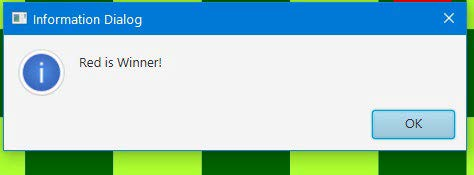

# Clever Checkers

This is a GUI based checkers game. Additionaly it has an Artificial Intelligence based playing agent you can play against.

## Getting Started

To get this project up and running on your local machine, all you need to do is clone or download this project, and complie this in any java compiler.

### Prerequisites

JavaFx liberaries are required to run the GUI based features.

## Using the Application

1. As soon as the game starts, the user is asked to choose a mode to continue playing. There are three modes available viz a viz AI vs AI, AI vs Human, Human vs Human.

	

	* From the drop down if the user chooses the AI vs Human mode then the user is again given 5 options to choose the difficulty.

	

	* If the game mode chosen is AI vs AI. The user is required to click anywhere on the screen to make the artificial agents play the next moves.

2. In order to make a human move, the user clicks on his respective pieces. Upon clicking the piece the possible moves applicable on the piece are reflected on the board in the form of pink circles.

3. Upon clicking on the pink circles, the respective piece moves to the new location.
4. The rules of the game suggest that if a player in one of his chances can capture the other players piece, then he must do that. However, if there are multiple pieces in capturing position the player is free to choose any one of them. So, in such a situation the pink circles only show up for the pieces that are in a capturing position and if the user clicks on another piece, he is given the given below persistent notification. Note that a similar notification shows up if the players tries to move a piece that is blocked by the opponents or one of his own pieces.

5. The game GUI also features a score board at the bottom of the screen which shows the scores of the two players and the color of the player who plays next.

6. Upon completion of the game, a dialogue is shown which tells the name of the winner.

## Logic

The game uses MiniMax algorithm with alpha beta pruning for the artificial agents.
The game rules which have been implemented are given [here](https://www.ducksters.com/games/checkers_rules.php)

## Built with
* [JavaFx](https://openjfx.io/) - Used for a the GUI.

## Contributing

I am open to contributions. Contact me on [Facebook](https://www.facebook.com/mishraprateekaries) for any queries.

## Authors

* Prateek Mishra

See also the list of [contributors](https://github.com/MiKinshu/Clever-Checkers/graphs/contributors) who participated in the project.

## Acknowledgements
* I am thankful to Dr. Rahul Kala (My AI instructor) for giving me this project and teaching me the basics of Artificial Intelligence.
